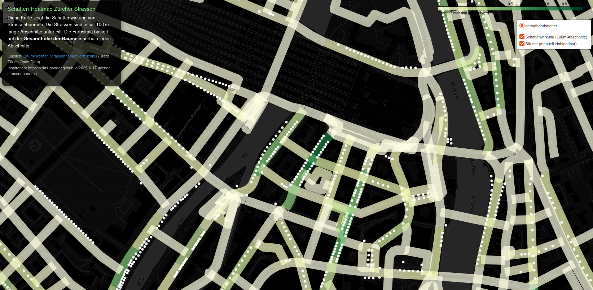

# Zürcher Strassenenbäume

Diese Repo basiert auf der Idee von [Wiener Strassenbäume](https://github.com/elias-gander/WienerStrassenbaeume).

Ausgehend der Geodaten vom [Strassennamenverzeichnis](https://www.stadt-zuerich.ch/geodaten/download/Strassennamenverzeichnis) und [Bauminventar](https://www.stadt-zuerich.ch/geodaten/download/Bauminventar) der Stadt Zürich wird geschätz, wo es wie viel Schatten durch Bäume gibt.

In Zürich sind nicht die gleichen Informationen, wie in Wien enthalten. Es fehlt zum Beispiel die Breite der Strasse und die Grösse der Baumkrone. Deswegen gehen wir der Einfachheit halber von der Höhe der Bäume aus und nehmen an, dass höhere Bäume mehr Schatten spenden.

